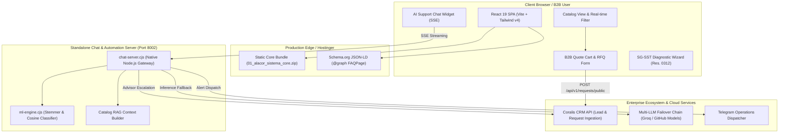

# ALACOR S.A.S. — Industrial Safety Platform & B2B E-Commerce Gateway

<div align="center">

[](https://react.dev/)
[](https://vitejs.dev/)
[](https://tailwindcss.com/)
[](https://nodejs.org/)
[](LICENSE)
[](#devsecops--security-governance)

<p align="center">
  <strong>Plataforma web corporativa de alta disponibilidad para comercio B2B de Equipos de Protección Personal (EPP), asesoría técnica en SG-SST y pasarela conversacional con inteligencia artificial integrada a Coralis CRM.</strong>
</p>

</div>

---

## 📋 Executive Summary

**ALACOR S.A.S.** es una compañía colombiana líder en el suministro y asesoría técnica de Equipos de Protección Personal (EPP) y soluciones integrales de Seguridad y Salud en el Trabajo (SG-SST). Esta plataforma web unificada resuelve el desafío crítico que enfrentan coordinadores de compras industriales y jefes de SST: la selección, validación normativa y adquisición de equipamiento certificado bajo estándares nacionales e internacionales (Res. 4272/2021 de alturas, Res. 0312/2019 de estándares mínimos, ANSI/ISEA, NIOSH y normas EN).

La arquitectura tecnológica articula un frontend reactivo ultraligero con catálogo dinámico de más de 1.300 referencias activas, un cotizador corporativo B2B que elimina la fricción de precios minoristas y radica solicitudes formales (`REQ-...`) directamente en **Coralis CRM**, y un gateway conversacional impulsado por modelos de lenguaje (LLM) con redundancia automática y contexto RAG para brindar asesoría técnica inmediata y filtrado de requerimientos 24/7.

---

## 🏛️ System Architecture



---

## 🚀 Key Features

* **Catálogo Industrial Indexable:** Exploración fluida y búsqueda reactiva de alta precisión en tiempo real por modelo, referencia técnica, marca y características de seguridad.
* **Cotizador Formal B2B:** Flujo de solicitud formal con validación automática del Dígito de Verificación (DV) de la DIAN según el NIT corporativo, radicación oficial en CRM y respuesta comercial vía correo electrónico en 1-2 horas hábiles.
* **Portal SG-SST Interactivo:** Wizard de autodiagnóstico en 4 pasos para evaluar el cumplimiento de Estándares Mínimos (Resolución 0312 de 2019) según tamaño de empresa y clase de riesgo (I a V).
* **Módulo FAQ Normativo de Alto Impacto:** 10 preguntas técnicas y comerciales clave respaldadas por estadísticas oficiales (Consejo Colombiano de Seguridad / Fasecolda, Ministerio del Trabajo, Función Pública, CDC/NIOSH), integradas con `<span>` tooltips discretos para retención de tráfico.
* **Optimización SEO Integral:** Datos estructurados Schema.org (`FAQPage`, `Organization`, `WebSite`, `BreadcrumbList`), Open Graph, meta-etiquetas dinámicas, sitemap XML y políticas de rastreo en `robots.txt`.
* **Pasarela de Asistente IA Resiliente:** Servidor Node.js nativo con Server-Sent Events (SSE), motor de clasificación vectorial liviano (`ml-engine.cjs`) y fallback encadenado de proveedores LLM.

---

## 📂 Project Directory Structure

```text
web-redesign-alacor/
├── .env.example              # Documented environment variables template
├── .gitignore                # DevSecOps zero-leak exclusion rules
├── LICENSE                   # MIT License
├── README.md                 # Project technical documentation
├── VERSION.json              # Canonical release versioning
├── CHANGELOG.md              # Historical version changelog
├── package.json              # Project dependencies and npm scripts
├── vite.config.js            # Vite bundler & Rolldown optimization settings
├── deploy.cjs                # Automated atomic deployment script (SSH/SCP)
├── chat-server.cjs           # Native Node.js Chat Gateway & CRM dispatcher
├── ml-engine.cjs             # Micro-ML NLP & Stemmer classification engine
├── ai-config.example.json    # LLM provider configuration template
├── chat_config.example.json  # Telegram notification gateway template
├── index.html                # Entry point, SEO meta tags & Schema.org graph
├── public/                   # Public static assets
│   ├── .htaccess             # Production Apache rewrite & cache directives
│   ├── favicon.ico           # High-resolution favicon
│   ├── robots.txt            # SEO crawler directives
│   └── sitemap.xml           # XML sitemap index
├── src/                      # Application source code
│   ├── App.jsx               # Main SPA router, state manager & views
│   ├── index.css             # Tailwind v4 theme tokens & design system
│   ├── main.jsx              # React DOM initialization
│   ├── components/           # Modular visual components
│   │   ├── Catalog/          # PortfolioView & Product Cards
│   │   ├── Sgsst/            # SG-SST 0312 Diagnostic Wizard
│   │   └── Modals/           # Lead capture & Terms dialogs
│   └── services/             # API clients & Quote service integrations
└── scripts/                  # Data ingestion & catalog tooling utilities
```

---

## 🛠️ Quick Start Guide

### Prerequisites
* **Node.js** >= 18.0.0
* **npm** >= 9.0.0

### 1. Clone & Setup
```bash
git clone https://github.com/falarcode-ops/web-redesign-alacor.git
cd web-redesign-alacor
```

### 2. Environment Configuration
Copy the provided `.env.example` file to create your local environment:
```bash
cp .env.example .env.local
```

Configure your local parameters inside `.env.local`:
```ini
DEPLOY_SSH_USER=deploy_user
DEPLOY_SSH_HOST=your-remote-server.example.com
DEPLOY_REMOTE_DIR=/home/alacor/comercial
CORALIS_CRM_HOST=127.0.0.1
PORT=8002
```

### 3. Install Dependencies
```bash
npm install
```

### 4. Development Server
Start the local Vite development server with Hot Module Replacement (HMR):
```bash
npm run dev
```
Open [http://localhost:5173](http://localhost:5173) in your browser.

### 5. Production Build
Compile and bundle the client application for production into `dist/`:
```bash
npm run build
```

### 6. Production Deployment
Execute the automated atomic deployment pipeline:
```bash
node deploy.cjs
```

---

## 🔒 DevSecOps & Security Governance

This repository adheres to the **Universal DevSecOps Audit Standard**:
* **Zero Secrets Leakage:** No plaintext API keys, tokens, database credentials, or internal IP addresses are committed to version control.
* **Environment Isolation:** Live configuration files (`.env*`, `ai-config.json`, `chat_config.json`, `subscribers.json`) are strictly blocked by `.gitignore`.
* **Sanitized Templates:** Public-ready `.env.example`, `ai-config.example.json`, and `chat_config.example.json` provide clear configuration contracts with zero exposure.
* **Atomic Zero-Downtime Deployment:** The deployment runner (`deploy.cjs`) validates builds, creates compressed artifacts, and applies atomic directory swaps on the target server.

---

## 📄 License

This project is licensed under the terms of the [MIT License](LICENSE).  
Copyright © 2026 **ALACOR S.A.S.** / **falarcode-ops**.
